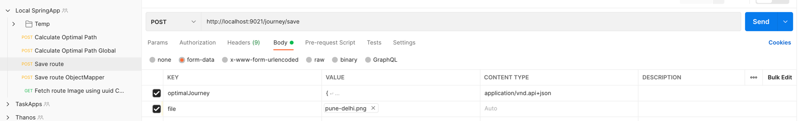

# Virtual Hub Service
---

This is the service to find optimal for your journey.

It uses

1. Java 11
2. Spring Boot


### Pre-requisites
---
1. Install Java 11
2. gradle 7.1 for command line usage (via sdkman)

### Build
---
```bash
gradle build
```


### Test
---
```bash
gradle test
```

### Run
---
This service runs on port 9021

### PostMan Requests

####Rest API 1:
Post for optimal path method URL: http://localhost:9021/journey/optimal-path

Request:
```json
{
  "origin": {
    "lng": "18.5529",
    "lat": "73.8797",
    "name": "Yerwada"
  },
  "wayPoints": [
    {
      "lng": "18.5089",
      "lat": "73.9259",
      "name": "Magarptta"
    },
    {
      "lng": "18.5018",
      "lat": "73.8636",
      "name": "Swargate"
    },
    {
      "lng": "18.4879",
      "lat": "74.0234",
      "name": "Hingewadi"
    }
  ]
}
```
Response:
```json
{
  "origin": {
    "lat": 73.8797,
    "lng": 18.5529,
    "name": "Yerwada"
  },
  "destination": {
    "lat": 73.9259,
    "lng": 18.5089,
    "name": "Magarptta"
  },
  "wayPoints": [
    {
      "lat": 73.8636,
      "lng": 18.5018,
      "name": "Swargate"
    },
    {
      "lat": 74.0234,
      "lng": 18.4879,
      "name": "Hingewadi"
    }
  ]
}
```

####Rest API 2:
Saving route with image POST URL: http://localhost:9021/journey/save/v1

Form Data should be passed as follows from ui or postman

 where optimalJourney is
```json
{
    "origin": {
        "lng": "18.5529° N",
        "lat": "73.8797° E",
        "name": "Yerwada"
    },
    "destination": {
        "lng": "18.4879° N",
        "lat": "74.0234° E",
        "name": "Hingewadi"
    },
    "waypoints": [
        {
            "lng": "18.5089° N",
            "lat": "73.9259° E",
            "name": "Magarptta"
        },
        {
            "lng": "18.5018° N",
            "lat": "73.8636° E",
            "name": "Swargate"
        }
    ]
}
```

response will be UUID eg **c299fd00-fe86-4f1f-847c-6a1efa1c5dd5**


####Rest API 3:
Retrieving the saved image URL: http://localhost:9021/journey/fetch/{uuid}

response will be S3 URL: https://bucketName.s3.region.amazonaws.com/1669646654841_<fileName>.png


###Running the APP
```
Start PostGres Container
docker run --name middle-east-postgres -e POSTGRES_PASSWORD=mysecretpassword -p 5433:5432 -d postgres

Log into Container Bash
docker exec -it middle-east-postgres bash

psql -U postgres

CREATE TABLE journey_response
  (
     id         UUID NOT NULL, 
     user_name       VARCHAR(100),
     journey jsonb,
     route_image_url VARCHAR(255),
     PRIMARY KEY (id)
  );
```
